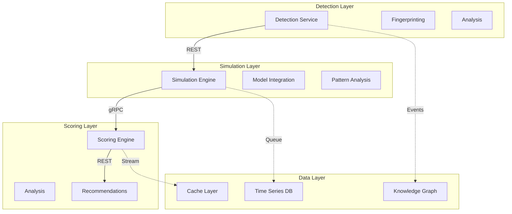

# AI Agent Systems Implementation Plans

## Overview
This document details the implementation plans for each AI agent system, considering Vercel's free tier constraints and optimal performance requirements.

## 1. AI Detection System

### Core Components
```typescript
interface AIDetectionSystem {
  fingerprinting: {
    networkAnalysis: {
      headers: HeaderAnalyzer;
      timing: TimingAnalyzer;
      patterns: PatternMatcher;
    };
    behavioralAnalysis: {
      interactions: InteractionTracker;
      navigation: NavigationAnalyzer;
      queries: QueryAnalyzer;
    };
    signatureGeneration: {
      hash: SignatureGenerator;
      confidence: ConfidenceCalculator;
      verification: SignatureVerifier;
    };
  };
}
```

### Implementation Strategy
```typescript
// Location: packages/ai-core/src/detection/
interface DetectionStrategy {
  edge: {
    // Fast, lightweight detection at edge
    components: {
      basicFingerprinting: boolean;    // Header analysis
      simplePatterns: boolean;         // Basic patterns
      quickVerification: boolean;      // Fast checks
    };
    maxProcessingTime: '50ms';
  };
  
  server: {
    // Detailed analysis on server
    components: {
      deepAnalysis: boolean;           // Complex patterns
      behaviorTracking: boolean;       // User behavior
      mlClassification: boolean;       // ML models
    };
    maxProcessingTime: '2s';
  };
  
  async: {
    // Background processing
    components: {
      patternLearning: boolean;        // Pattern updates
      modelTraining: boolean;          // ML training
      signatureUpdates: boolean;       // Sig database
    };
    schedule: 'daily' | 'weekly';
  };
}
```

## 2. AI Simulation Engine

### Core Components
```typescript
interface AISimulationSystem {
  models: {
    openai: {
      gpt4: GPT4Integration;
      gpt35: GPT35Integration;
      tokenization: TokenManager;
    };
    anthropic: {
      claude3: Claude3Integration;
      claude2: Claude2Integration;
      contextManager: ContextManager;
    };
    gemini: {
      pro: GeminiProIntegration;
      advanced: GeminiAdvancedFeatures;
      streamManager: StreamManager;
    };
  };
  
  scenarios: {
    generation: ScenarioGenerator;
    execution: ScenarioExecutor;
    analysis: ResultAnalyzer;
  };
  
  optimization: {
    tokenUsage: TokenOptimizer;
    contextWindow: ContextOptimizer;
    costManagement: CostManager;
  };
}
```

### Implementation Strategy
```typescript
// Location: packages/ai-core/src/simulation/
interface SimulationStrategy {
  preprocessing: {
    // Content preparation
    tasks: {
      tokenization: boolean;          // Token counting
      contextPreparation: boolean;    // Context setup
      promptGeneration: boolean;      // Prompt creation
    };
    maxProcessingTime: '1s';
  };
  
  execution: {
    // Model interaction
    parallel: {
      maxConcurrent: 1;              // Free tier limit
      queueing: boolean;             // Request queue
      prioritization: boolean;        // Priority system
    };
    timeouts: {
      softLimit: '7s';               // Normal timeout
      hardLimit: '9s';               // Hard timeout
      gracefulDegradation: boolean;  // Fallback
    };
  };
  
  postprocessing: {
    // Result processing
    analysis: {
      responseValidation: boolean;    // Validate responses
      patternExtraction: boolean;     // Extract patterns
      insightGeneration: boolean;     // Generate insights
    };
    storage: {
      compression: boolean;           // Compress results
      caching: boolean;              // Cache results
      archival: boolean;             // Archive data
    };
  };
}
```

## 3. Integration Points

### API Integration
```typescript
interface APIIntegration {
  endpoints: {
    detection: {
      path: '/api/detect';
      method: 'POST';
      rateLimit: 100;              // Requests per hour
    };
    simulation: {
      path: '/api/simulate';
      method: 'POST';
      rateLimit: 50;               // Requests per hour
    };
    analysis: {
      path: '/api/analyze';
      method: 'POST';
      rateLimit: 200;              // Requests per hour
    };
  };
  
  security: {
    authentication: 'API_KEY';
    rateLimit: {
      window: '1h';
      max: 1000;
    };
    monitoring: {
      logging: boolean;
      alerts: boolean;
      metrics: boolean;
    };
  };
}
```

## 4. Scoring & Analysis System

### Core Components
```typescript
interface ScoringSystem {
  analysis: {
    content: {
      semantic: SemanticAnalyzer;
      structure: StructureAnalyzer;
      relevance: RelevanceCalculator;
    };
    technical: {
      accessibility: AccessibilityChecker;
      performance: PerformanceAnalyzer;
      optimization: OptimizationScorer;
    };
    aiSpecific: {
      comprehension: ComprehensionAnalyzer;
      context: ContextEvaluator;
      tokenEfficiency: TokenEfficiencyScorer;
    };
  };
  
  scoring: {
    calculation: {
      weights: WeightManager;
      algorithms: ScoringAlgorithms;
      normalization: ScoreNormalizer;
    };
    validation: {
      rules: RuleEngine;
      thresholds: ThresholdManager;
      calibration: ScoreCalibrator;
    };
  };
}
```

### Implementation Strategy
```typescript
// Location: packages/ai-core/src/scoring/
interface ScoringStrategy {
  realTime: {
    // Immediate scoring components
    components: {
      basicAnalysis: boolean;         // Quick analysis
      preliminaryScore: boolean;      // Initial score
      instantFeedback: boolean;       // Quick feedback
    };
    maxProcessingTime: '3s';
  };
  
  background: {
    // Detailed analysis
    components: {
      deepContentAnalysis: boolean;   // Full content
      aiInteractionSim: boolean;      // AI simulation
      comparativeAnalysis: boolean;   // Benchmarking
    };
    maxProcessingTime: '30s';
    scheduling: 'queued';
  };
  
  optimization: {
    caching: {
      strategy: 'stale-while-revalidate';
      duration: '24h';
      invalidation: string[];
    };
    computation: {
      distribution: 'edge-and-server';
      prioritization: 'user-facing-first';
      fallback: 'cached-scores';
    };
  };
}
```

## 5. Recommendation Engine

### Core Components
```typescript
interface RecommendationSystem {
  analysis: {
    patterns: {
      success: SuccessPatternAnalyzer;
      improvement: ImprovementAnalyzer;
      correlation: CorrelationEngine;
    };
    context: {
      industry: IndustryAnalyzer;
      competitors: CompetitorAnalyzer;
      trends: TrendAnalyzer;
    };
  };
  
  generation: {
    recommendations: {
      prioritization: PriorityEngine;
      customization: CustomizationEngine;
      validation: ValidationSystem;
    };
    implementation: {
      roadmap: RoadmapGenerator;
      steps: StepGenerator;
      timeline: TimelineManager;
    };
  };
  
  tracking: {
    implementation: ImplementationTracker;
    effectiveness: EffectivenessAnalyzer;
    impact: ImpactCalculator;
  };
}
```

### Implementation Strategy
```typescript
// Location: packages/ai-core/src/recommendations/
interface RecommendationStrategy {
  generation: {
    // Recommendation generation
    process: {
      analysis: boolean;             // Pattern analysis
      synthesis: boolean;            // Recommendation creation
      validation: boolean;           // Quality check
    };
    constraints: {
      maxRecommendations: 10;       // Per batch
      priorityLevels: 3;            // Priority tiers
      refreshInterval: '7d';        // Update frequency
    };
  };
  
  delivery: {
    // Recommendation delivery
    methods: {
      dashboard: boolean;           // UI display
      api: boolean;                // API access
      notifications: boolean;      // Alert system
    };
    optimization: {
      batching: boolean;          // Batch updates
      progressive: boolean;       // Progressive loading
      caching: boolean;          // Cache strategy
    };
  };
}
```

## 6. Monitoring & Analytics

### Core Components
```typescript
interface MonitoringSystem {
  tracking: {
    usage: {
      requests: RequestTracker;
      performance: PerformanceMonitor;
      errors: ErrorTracker;
    };
    business: {
      scores: ScoreTracker;
      improvements: ImprovementTracker;
      engagement: EngagementMonitor;
    };
  };
  
  analytics: {
    processing: {
      aggregation: DataAggregator;
      analysis: TrendAnalyzer;
      prediction: PredictionEngine;
    };
    reporting: {
      generation: ReportGenerator;
      scheduling: ReportScheduler;
      distribution: ReportDistributor;
    };
  };
}
```

### Monitoring Implementation Strategy
```typescript
// Location: packages/ai-core/src/monitoring/
interface MonitoringStrategy {
  realTime: {
    // Live monitoring
    metrics: {
      performance: {
        latency: boolean;          // Response times
        throughput: boolean;       // Request rates
        errorRates: boolean;       // Error tracking
      };
      resources: {
        cpuUsage: boolean;        // CPU utilization
        memoryUsage: boolean;     // Memory usage
        storageUsage: boolean;    // Storage usage
      };
      costs: {
        apiCalls: boolean;        // API usage costs
        storage: boolean;         // Storage costs
        compute: boolean;         // Compute costs
      };
    };
    alerts: {
      thresholds: {
        critical: number;         // Critical alerts
        warning: number;         // Warning alerts
        info: number;            // Info alerts
      };
      channels: {
        dashboard: boolean;      // UI alerts
        email: boolean;         // Email notifications
        webhook: boolean;       // Webhook notifications
      };
    };
  };

  analytics: {
    // Analysis and reporting
    processing: {
      interval: '5m' | '1h' | '1d';
      aggregation: {
        timeframes: string[];    // Analysis periods
        metrics: string[];       // Tracked metrics
        dimensions: string[];    // Analysis dimensions
      };
      storage: {
        retention: '30d';       // Data retention
        resolution: '1m';       // Data resolution
        compression: boolean;   // Data compression
      };
    };
    reporting: {
      scheduled: {
        daily: boolean;        // Daily reports
        weekly: boolean;       // Weekly reports
        monthly: boolean;      // Monthly reports
      };
      formats: {
        json: boolean;        // JSON format
        csv: boolean;         // CSV format
        pdf: boolean;         // PDF format
      };
    };
  };
}
```

## 7. AI Agent Interaction Tracker

### Core Components
```typescript
interface AgentInteractionSystem {
  tracking: {
    interaction: {
      session: SessionTracker;
      behavior: BehaviorAnalyzer;
      patterns: PatternRecognizer;
    };
    content: {
      access: ContentAccessTracker;
      usage: ContentUsageAnalyzer;
      effectiveness: EffectivenessTracker;
    };
    performance: {
      response: ResponseAnalyzer;
      quality: QualityAssessor;
      optimization: OptimizationTracker;
    };
  };

  analysis: {
    patterns: {
      identification: PatternIdentifier;
      classification: PatternClassifier;
      prediction: PatternPredictor;
    };
    effectiveness: {
      scoring: EffectivenessScorer;
      comparison: ComparisonEngine;
      trending: TrendAnalyzer;
    };
  };

  optimization: {
    recommendations: {
      generation: RecommendationGenerator;
      prioritization: PriorityEngine;
      validation: ValidationEngine;
    };
    automation: {
      adjustment: AutoAdjuster;
      learning: LearningEngine;
      deployment: DeploymentManager;
    };
  };
}
```

### Implementation Strategy
```typescript
// Location: packages/ai-core/src/interaction/
interface InteractionStrategy {
  collection: {
    // Data collection
    methods: {
      passive: {
        headers: boolean;         // Header analysis
        timing: boolean;          // Timing analysis
        patterns: boolean;        // Pattern tracking
      };
      active: {
        probing: boolean;        // Active probing
        simulation: boolean;     // Interaction simulation
        validation: boolean;     // Result validation
      };
    };
    constraints: {
      maxEvents: number;        // Events per session
      samplingRate: number;     // Sampling frequency
      storageLimit: string;     // Storage limit
    };
  };

  processing: {
    // Data processing
    pipeline: {
      enrichment: boolean;      // Data enrichment
      correlation: boolean;     // Event correlation
      aggregation: boolean;    // Data aggregation
    };
    optimization: {
      batching: boolean;       // Batch processing
      streaming: boolean;      // Stream processing
      caching: boolean;       // Result caching
    };
  };

  storage: {
    // Data storage
    strategy: {
      hotData: {
        storage: 'Vercel KV';
        retention: '24h';
        access: 'high-speed';
      };
      warmData: {
        storage: 'Supabase';
        retention: '30d';
        access: 'medium-speed';
      };
      coldData: {
        storage: 'S3';
        retention: '365d';
        access: 'low-speed';
      };
    };
  };
}
```

## 8. AI Agent-Specific Implementations

### OpenAI Integration
```typescript
interface OpenAIIntegration {
  models: {
    gpt4: {
      version: 'gpt-4-turbo-preview';
      maxTokens: 128000;
      contextWindow: 128000;
      features: {
        streaming: boolean;
        functionCalling: boolean;
        jsonMode: boolean;
        parallelRequests: boolean;
      };
      constraints: {
        rateLimit: 500;           // requests/minute
        costOptimization: boolean;
        errorHandling: boolean;
      };
    };
    gpt35: {
      version: 'gpt-3.5-turbo';
      maxTokens: 16385;
      contextWindow: 16385;
      features: {
        streaming: boolean;
        functionCalling: boolean;
        jsonMode: boolean;
      };
      constraints: {
        rateLimit: 3;            // requests/minute (free tier)
        maxTokensPerRequest: 4000;
        costOptimization: boolean;
      };
    };
  };

  optimization: {
    tokenization: {
      preprocessing: boolean;     // Pre-tokenization
      compression: boolean;      // Token compression
      caching: boolean;         // Token caching
    };
    costManagement: {
      budgeting: boolean;       // Budget controls
      quotas: boolean;         // Usage quotas
      optimization: boolean;   // Cost optimization
    };
    performance: {
      parallelization: boolean; // Parallel requests
      batching: boolean;       // Request batching
      caching: boolean;        // Response caching
    };
  };
}
```

### Anthropic Integration
```typescript
interface AnthropicIntegration {
  models: {
    claude3: {
      version: 'claude-3-opus';
      maxTokens: 200000;
      contextWindow: 200000;
      features: {
        streaming: boolean;
        toolUse: boolean;
        imageAnalysis: boolean;
        parallelRequests: boolean;
      };
      constraints: {
        rateLimit: 'configurable';
        costOptimization: boolean;
        errorHandling: boolean;
      };
    };
    claude2: {
      version: 'claude-2.1';
      maxTokens: 100000;
      contextWindow: 100000;
      features: {
        streaming: boolean;
        toolUse: boolean;
      };
      constraints: {
        rateLimit: 3;           // requests/minute (free tier)
        costOptimization: boolean;
        errorHandling: boolean;
      };
    };
  };

  capabilities: {
    analysis: {
      contentUnderstanding: boolean;
      contextRetention: boolean;
      nuancedAnalysis: boolean;
    };
    interaction: {
      conversationMemory: boolean;
      followUpQueries: boolean;
      clarifications: boolean;
    };
  };
}
```

### Gemini Integration
```typescript
interface GeminiIntegration {
  models: {
    geminiPro: {
      version: 'gemini-pro';
      maxTokens: 32000;
      contextWindow: 32000;
      features: {
        streaming: boolean;
        functionCalling: boolean;
        multimodal: boolean;
      };
      constraints: {
        rateLimit: 60;          // requests/minute
        costOptimization: boolean;
        errorHandling: boolean;
      };
    };
  };

  optimization: {
    resourceUsage: {
      batchProcessing: boolean;
      requestPooling: boolean;
      cacheStrategy: boolean;
    };
    performance: {
      latencyOptimization: boolean;
      throughputScaling: boolean;
      errorHandling: boolean;
    };
  };
}
```

### Perplexity Integration
```typescript
interface PerplexityIntegration {
  models: {
    pplx70b: {
      version: 'pplx-70b-online';
      maxTokens: 4096;
      contextWindow: 4096;
      features: {
        streaming: boolean;
        onlineSearch: boolean;
        citations: boolean;
      };
      constraints: {
        rateLimit: 'configurable';
        costOptimization: boolean;
        errorHandling: boolean;
      };
    };
    pplx7b: {
      version: 'pplx-7b-online';
      maxTokens: 4096;
      contextWindow: 4096;
      features: {
        streaming: boolean;
        onlineSearch: boolean;
        citations: boolean;
      };
      constraints: {
        rateLimit: 3;           // requests/minute (free tier)
        costOptimization: boolean;
        errorHandling: boolean;
      };
    };
  };

  optimization: {
    search: {
      caching: boolean;
      optimization: boolean;
      fallback: boolean;
    };
    citations: {
      validation: boolean;
      formatting: boolean;
      linking: boolean;
    };
  };
}
```

## 9. Error Handling & Recovery Strategies

### Global Error Management
```typescript
interface ErrorManagement {
  detection: {
    patterns: {
      rateLimit: RateLimitDetector;
      timeout: TimeoutDetector;
      validation: ValidationErrorDetector;
    };
    monitoring: {
      realTime: RealTimeMonitor;
      trending: TrendAnalyzer;
      alerting: AlertManager;
    };
  };

  handling: {
    strategies: {
      retry: {
        maxAttempts: number;
        backoffStrategy: 'exponential' | 'linear';
        jitter: boolean;
      };
      fallback: {
        cacheFallback: boolean;
        degradedMode: boolean;
        alternativeService: boolean;
      };
      recovery: {
        autoRecovery: boolean;
        manualIntervention: boolean;
        dataReconciliation: boolean;
      };
    };
  };

  logging: {
    levels: {
      error: ErrorLogger;
      warning: WarningLogger;
      info: InfoLogger;
    };
    storage: {
      retention: string;
      aggregation: boolean;
      analysis: boolean;
    };
  };
}
```

### Recovery Procedures
```typescript
interface RecoveryProcedures {
  serviceRecovery: {
    steps: {
      detection: {
        healthCheck: boolean;
        dependencyCheck: boolean;
        stateValidation: boolean;
      };
      isolation: {
        serviceIsolation: boolean;
        impactAssessment: boolean;
        userNotification: boolean;
      };
      restoration: {
        stateRecovery: boolean;
        dataReconciliation: boolean;
        serviceResumption: boolean;
      };
    };
    validation: {
      integrityChecks: boolean;
      performanceMetrics: boolean;
      userImpact: boolean;
    };
  };
}
```

## 10. Integration Patterns Between Systems

### Core Integration Architecture
```typescript
interface SystemIntegration {
  patterns: {
    synchronous: {
      restAPI: {
        endpoints: string[];
        versioning: boolean;
        documentation: boolean;
      };
      grpc: {
        services: string[];
        protoDefinitions: boolean;
        streaming: boolean;
      };
      webhooks: {
        events: string[];
        retries: boolean;
        validation: boolean;
      };
    };
    asynchronous: {
      messageQueue: {
        topics: string[];
        deadLetter: boolean;
        ordering: boolean;
      };
      eventBus: {
        publishers: string[];
        subscribers: string[];
        filtering: boolean;
      };
      streaming: {
        realTime: boolean;
        batching: boolean;
        backpressure: boolean;
      };
    };
  };
}
```

### System-to-System Integration Map


### Integration Specifications
```typescript
interface IntegrationSpecs {
  detectionToSimulation: {
    type: 'synchronous';
    protocol: 'REST';
    endpoints: {
      detection: '/api/detect';
      patterns: '/api/patterns';
      analysis: '/api/analyze';
    };
    security: {
      authentication: boolean;
      rateLimit: number;
      timeout: number;
    };
  };

  simulationToScoring: {
    type: 'hybrid';
    protocols: {
      sync: 'gRPC';
      async: 'MessageQueue';
    };
    services: {
      scoring: ScoreCalculation;
      analysis: ResultAnalysis;
      feedback: FeedbackLoop;
    };
    optimization: {
      batching: boolean;
      caching: boolean;
      compression: boolean;
    };
  };

  scoringToRecommendations: {
    type: 'asynchronous';
    protocol: 'EventStream';
    events: {
      scoreUpdate: ScoreEvent;
      insightGeneration: InsightEvent;
      recommendationTrigger: RecommendationEvent;
    };
    processing: {
      ordering: boolean;
      deduplication: boolean;
      enrichment: boolean;
    };
  };
}
```

### Cross-System Data Flow
```typescript
interface CrossSystemDataFlow {
  realTime: {
    detection: {
      output: DetectionResult;
      destination: 'simulation';
      timing: 'immediate';
    };
    simulation: {
      output: SimulationResult;
      destination: 'scoring';
      timing: 'near-realtime';
    };
    scoring: {
      output: ScoreResult;
      destination: 'recommendations';
      timing: 'batch';
    };
  };

  background: {
    analytics: {
      source: 'all-systems';
      processing: 'aggregated';
      storage: 'time-series';
    };
    learning: {
      source: 'patterns';
      processing: 'ml-pipeline';
      storage: 'model-store';
    };
    optimization: {
      source: 'metrics';
      processing: 'analysis';
      storage: 'knowledge-graph';
    };
  };
}
```

### Integration Error Handling
```typescript
interface IntegrationErrorHandling {
  circuitBreaker: {
    thresholds: {
      errorRate: number;
      timeout: number;
      volume: number;
    };
    states: {
      closed: 'normal';
      open: 'failing';
      halfOpen: 'testing';
    };
    recovery: {
      backoff: 'exponential';
      maxAttempts: number;
      resetTimeout: number;
    };
  };

  fallbackStrategies: {
    caching: {
      ttl: string;
      refresh: 'background';
      staleness: 'acceptable';
    };
    degradation: {
      modes: string[];
      features: string[];
      notification: boolean;
    };
    alternatives: {
      services: string[];
      routing: 'automatic';
      synchronization: boolean;
    };
  };
}
```