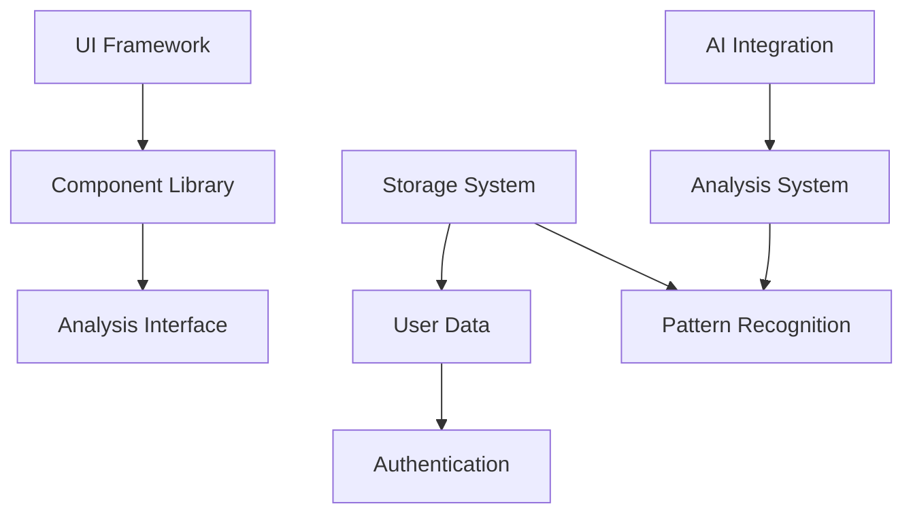

# Granular Task Tracking 2024

## Task Status Legend

- [ ] Not Started (No implementation)
- [~] In Progress (Partial implementation)
- [✓] Completed (Verified working)
- [!] Blocked (Dependencies pending)
- [x] Cancelled (Not needed)

## Task Metadata Template

```typescript
interface TaskMetadata {
  name: string;
  status: TaskStatus;
  priority: 'Critical' | 'High' | 'Medium' | 'Low';
  assignee?: string;
  startDate?: Date;
  endDate?: Date;
  dependencies: {
    required: string[];
    optional: string[];
    parallel: string[];
    impacts: string[];
  };
  blockers?: string[];
  metrics: {
    performance?: string;
    quality?: string;
    coverage?: string;
    cost?: string;
  };
  notes: string[];
}
```

## Core Infrastructure [Current Focus]

### Project Setup [In Progress]
- [✓] Base Configuration
  - [✓] Next.js 15 setup with TypeScript
  - [✓] ESLint and Prettier
  - [✓] Turbo monorepo
  - [✓] PNPM workspace
  - [✓] Basic project structure
- [~] Package Structure
  - [✓] Directory organization
  - [✓] Basic package setup
  - [~] Inter-package dependencies
  - [ ] Package APIs
  - [ ] Version management
- [~] Development Environment
  - [✓] Local development setup
  - [✓] Environment variables
  - [✓] Development scripts
  - [~] Hot reloading
  - [✓] Debug configuration

### CI/CD Setup [In Progress]
- [✓] GitHub Actions Configuration
  - [✓] CI workflow setup
  - [✓] CD workflow setup
  - [✓] Build caching
  - [✓] Artifact handling
- [✓] Vercel Integration
  - [✓] Project configuration
  - [✓] Environment setup
  - [✓] Preview deployments
  - [✓] Build optimization

### Testing Infrastructure [In Progress]
- [~] Core Setup
  - [✓] Jest Configuration
  - [✓] Test environment
  - [✓] Basic test suite
  - [ ] Coverage setup
  - [ ] Reporter config
- [ ] Test Utilities
  - [ ] Mock data
  - [ ] Test helpers
  - [ ] Assertions
  - [ ] Fixtures

### Monitoring System [In Progress]
- [~] Logging System
  - [✓] Winston logger setup
    - [✓] Basic configuration
    - [✓] Console transport
    - [✓] File transport
    - [✓] Error handling
  - [~] Logflare Integration
    - [~] Transport setup
    - [ ] Batch processing
    - [ ] Stream handling
    - [ ] Error recovery
  - [ ] Log Management
    - [ ] Log rotation
    - [ ] Log compression
    - [ ] Retention policies
    - [ ] Archive system
- [~] Metrics Collection
  - [✓] Performance Monitoring
    - [✓] Vercel Analytics setup
    - [✓] Speed Insights integration
    - [✓] Core Web Vitals tracking
    - [~] Error tracking setup
  - [ ] Business Metrics
    - [ ] Usage tracking
    - [ ] Feature adoption
    - [ ] User engagement
    - [ ] Conversion rates

### UI Framework [Next Focus]
- [~] Core Setup
  - [✓] Next.js 15 configuration
  - [✓] Tailwind CSS setup
  - [~] Shadcn UI integration
    - [✓] Base components
    - [~] Theme system
    - [ ] Custom components
    - [ ] Dark mode
  - [ ] Motion System
    - [ ] Basic transitions
    - [ ] Page transitions
    - [ ] Loading states
    - [ ] Micro-interactions
- [ ] Component Library
  - [ ] Layout System
    - [ ] Grid system
    - [ ] Responsive layouts
    - [ ] Container components
    - [ ] Spacing system
  - [ ] Form System
    - [ ] Input components
    - [ ] Validation
    - [ ] Error handling
    - [ ] Accessibility
  - [ ] Data Display
    - [ ] Tables
    - [ ] Cards
    - [ ] Lists
    - [ ] Charts

### Storage System [To Be Started]
- [ ] Vercel KV Setup
  - [ ] Client configuration
  - [ ] Cache management
  - [ ] Error handling
  - [ ] Performance optimization
- [ ] Supabase Integration
  - [ ] Core setup
  - [ ] Schema design
  - [ ] Migration system
  - [ ] Query optimization
- [ ] Neo4j Setup
  - [ ] Core setup
  - [ ] Graph schema
  - [ ] Query optimization
  - [ ] Performance tuning

## Core Analysis System

### Knowledge Graph Core
- [ ] Graph Foundation
  - [ ] Core Implementation
    - [ ] Node system
    - [ ] Edge system
    - [ ] Property management
    - [ ] Index management
  - [ ] Query Engine
    - [ ] Basic queries
    - [ ] Complex traversals
    - [ ] Path finding
    - [ ] Pattern matching
  - [ ] Graph Operations
    - [ ] Graph creation
    - [ ] Graph updates
    - [ ] Graph merging
    - [ ] Graph validation

### Semantic Processing
- [ ] Core Processing
  - [ ] Content Analysis
    - [ ] Text processing
    - [ ] Structure analysis
    - [ ] Context extraction
    - [ ] Metadata processing
  - [ ] Semantic Analysis
    - [ ] Concept extraction
    - [ ] Entity recognition
    - [ ] Relationship detection
    - [ ] Context preservation
  - [ ] Knowledge Integration
    - [ ] Knowledge base updates
    - [ ] Relationship mapping
    - [ ] Context linking
    - [ ] Validation system

### Pattern Recognition
- [ ] Core Engine
  - [ ] Pattern Detection
    - [ ] Basic patterns
    - [ ] Complex patterns
    - [ ] Pattern validation
    - [ ] Pattern evolution
  - [ ] Analysis Pipeline
    - [ ] Data preprocessing
    - [ ] Feature extraction
    - [ ] Pattern matching
    - [ ] Result validation
  - [ ] Performance
    - [ ] Optimization
    - [ ] Caching
    - [ ] Batch processing
    - [ ] Resource management
  - [ ] Pattern Types
    - [ ] Interaction patterns
    - [ ] Behavior patterns
    - [ ] Query patterns
    - [ ] Response patterns
  - [ ] Pattern Analysis
    - [ ] Pattern clustering
    - [ ] Pattern ranking
    - [ ] Pattern evolution
    - [ ] Pattern validation
  - [ ] Advanced Recognition
    - [ ] Multi-agent patterns
    - [ ] Cross-context patterns
    - [ ] Temporal patterns
    - [ ] Hierarchical patterns

### Insights Engine
- [ ] Core Analysis
  - [ ] Data Processing
    - [ ] Data cleaning
    - [ ] Feature extraction
    - [ ] Normalization
    - [ ] Validation
  - [ ] Analysis Pipeline
    - [ ] Trend detection
    - [ ] Correlation analysis
    - [ ] Anomaly detection
    - [ ] Pattern recognition
  - [ ] Results Management
    - [ ] Storage strategy
    - [ ] Cache system
    - [ ] Export formats
    - [ ] Visualization
- [ ] Advanced Analysis
  - [ ] Chain Analysis
    - [ ] Reasoning chains
    - [ ] Decision paths
    - [ ] Inference patterns
    - [ ] Logic flows
  - [ ] Behavioral Analysis
    - [ ] Agent behaviors
    - [ ] Response patterns
    - [ ] Error patterns
    - [ ] Recovery patterns

### Website Certification System [In Progress]
- [~] Analysis System
  - [~] Website Analysis
    - [~] Content structure analysis
      - [~] HTML structure validation
      - [ ] Semantic markup analysis
      - [ ] Metadata completeness
      - [ ] Schema.org implementation
    - [ ] AI Accessibility Analysis
      - [ ] Content readability
      - [ ] Data structure clarity
      - [ ] API documentation
      - [ ] Error handling patterns
    - [ ] AI Interaction Patterns
      - [ ] Navigation optimization
      - [ ] Data extraction paths
      - [ ] Action identification
      - [ ] State management
  - [ ] Pattern Recognition
    - [ ] Common AI Patterns
      - [ ] Information retrieval
      - [ ] Task completion flows
      - [ ] Error recovery paths
    - [ ] Anti-Patterns
      - [ ] Blocked paths
      - [ ] Ambiguous structures
      - [ ] Missing context
    - [ ] Best Practices
      - [ ] Clear hierarchies
      - [ ] Consistent patterns
      - [ ] Explicit relationships

- [ ] Scoring System
  - [ ] Core Metrics
    - [ ] AI Accessibility Score
      - [ ] Content clarity
      - [ ] Structure coherence
      - [ ] Data accessibility
    - [ ] Interaction Score
      - [ ] Navigation efficiency
      - [ ] Task completion rate
      - [ ] Error handling
    - [ ] Integration Score
      - [ ] API usability
      - [ ] Documentation quality
      - [ ] Integration patterns
  - [ ] Scoring Algorithms
    - [ ] Pattern-based scoring
      - [ ] Pattern recognition
      - [ ] Weight calculation
      - [ ] Score normalization
    - [ ] Accessibility scoring
      - [ ] Readability metrics
      - [ ] Structure analysis
      - [ ] Context evaluation
    - [ ] Overall scoring
      - [ ] Score aggregation
      - [ ] Category weighting
      - [ ] Final normalization

- [ ] Validation System
  - [ ] Rule Engine
    - [ ] Core Rules
      - [ ] Structure validation
      - [ ] Pattern matching
      - [ ] Context verification
    - [ ] Custom Rules
      - [ ] Rule definition
      - [ ] Rule validation
      - [ ] Rule application
  - [ ] Validation Process
    - [ ] Automated Checks
      - [ ] Structure analysis
      - [ ] Pattern detection
      - [ ] Context validation
    - [ ] Manual Review
      - [ ] Expert validation
      - [ ] Edge case handling
      - [ ] Final approval

- [ ] Badge System
  - [ ] Badge Design
    - [ ] Visual Templates
      - [ ] Score indicators
      - [ ] Category markers
      - [ ] Dynamic elements
    - [ ] Badge Levels
      - [ ] Basic certification
      - [ ] Advanced certification
      - [ ] Expert certification
  - [ ] Badge Generation
    - [ ] Dynamic SVG
      - [ ] Score rendering
      - [ ] Style application
      - [ ] Cache management
    - [ ] Verification System
      - [ ] Status endpoints
      - [ ] Validity checks
      - [ ] Update handling

## Free Tier Implementation

### Single Page Application Core
- [ ] Application Shell
  - [ ] Core Structure
    - [ ] App layout setup
    - [ ] Route configuration
    - [ ] Navigation system
    - [ ] Error boundaries
    - [ ] Loading states
  - [ ] State Management
    - [ ] URL state handling
    - [ ] Local state setup
    - [ ] Cache management
    - [ ] Persistence layer
    - [ ] State synchronization
  - [ ] Performance Optimization
    - [ ] Code splitting
    - [ ] Dynamic imports
    - [ ] Asset optimization
    - [ ] Bundle analysis
    - [ ] Performance monitoring

### Client-Side Analysis Flow
- [ ] URL Input System
  - [ ] Input Validation
    - [ ] URL format checking
    - [ ] Protocol validation
    - [ ] Domain validation
    - [ ] Path validation
    - [ ] Query parameter handling
  - [ ] History Management
    - [ ] Recent URLs storage
    - [ ] Favorites system
    - [ ] History cleanup
    - [ ] Export/import
  - [ ] Error Handling
    - [ ] Invalid URL feedback
    - [ ] Connection issues
    - [ ] Timeout handling
    - [ ] Recovery options

### Real-Time Analysis Dashboard
- [ ] Analysis Progress
  - [ ] Progress Tracking
    - [ ] Stage indicators
    - [ ] Progress percentage
    - [ ] Time estimates
    - [ ] Cancel handling
  - [ ] Visual Feedback
    - [ ] Progress animations
    - [ ] Stage transitions
    - [ ] Error states
    - [ ] Success states
  - [ ] Status Updates
    - [ ] Current operation
    - [ ] Resource usage
    - [ ] Error reporting
    - [ ] Warning system

### Results Visualization
- [ ] Score Display
  - [ ] Core Metrics
    - [ ] Overall score
    - [ ] Category scores
    - [ ] Trend indicators
    - [ ] Comparative analysis
  - [ ] Visual Components
    - [ ] Score gauges
    - [ ] Progress bars
    - [ ] Radar charts
    - [ ] Timeline views
  - [ ] Interactive Elements
    - [ ] Drill-down views
    - [ ] Tooltip system
    - [ ] Filter controls
    - [ ] Sort options

### Report Generation
- [ ] Basic Report System
  - [ ] Content Organization
    - [ ] Section hierarchy
    - [ ] Priority sorting
    - [ ] Category grouping
    - [ ] Importance markers
  - [ ] Data Formatting
    - [ ] Score formatting
    - [ ] Metric presentation
    - [ ] Issue highlighting
    - [ ] Recommendation styling
  - [ ] Export Options
    - [ ] PDF generation
    - [ ] HTML export
    - [ ] JSON data
    - [ ] CSV format

### Upgrade Path Integration
- [ ] Feature Preview
  - [ ] Premium Features
    - [ ] Feature showcase
    - [ ] Demo capabilities
    - [ ] Limitation indicators
    - [ ] Upgrade benefits
  - [ ] Trial System
    - [ ] Trial activation
    - [ ] Usage tracking
    - [ ] Expiration handling
    - [ ] Conversion prompts
  - [ ] Upgrade Flow
    - [ ] Plan comparison
    - [ ] Feature matrix
    - [ ] Pricing display
    - [ ] Conversion path

### Client-Side Processing
- [ ] OpenRouter Integration
  - [ ] Core Setup
    - [ ] API configuration
    - [ ] Authentication handling
    - [ ] Rate limiting (60/min)
    - [ ] Error handling
    - [ ] Retry mechanism
  - [ ] Streaming Implementation
    - [ ] Stream setup
    - [ ] Chunk processing
    - [ ] Error recovery
    - [ ] Connection management
  - [ ] Response Processing
    - [ ] Data validation
    - [ ] Format conversion
    - [ ] Error mapping
    - [ ] Performance tracking
- [ ] AI Processing
  - [ ] Query Processing
    - [ ] Query construction
    - [ ] Context management
    - [ ] Token optimization
    - [ ] Response handling
  - [ ] Stream Management
    - [ ] Stream initialization
    - [ ] Chunk processing
    - [ ] Error recovery
    - [ ] Connection handling

### Processing Pipeline
  - [ ] Content Queue
    - [ ] Queue management
    - [ ] Priority handling
    - [ ] Concurrency control
    - [ ] Memory management
  - [ ] Resource Management
    - [ ] CPU utilization
    - [ ] Memory monitoring
    - [ ] Battery awareness
    - [ ] Network optimization
  - [ ] Background Processing
    - [ ] Web Worker setup
    - [ ] Task distribution
    - [ ] Progress reporting
    - [ ] Error handling

### Knowledge Graph System
- [ ] Core Graph Implementation
  - [ ] Node type definitions
  - [ ] Relationship mappings
  - [ ] Graph construction
  - [ ] Query optimization

### Basic Visualization System
- [ ] Core Components
  - [ ] Basic Charts
    - [ ] Score visualization
    - [ ] Progress tracking
    - [ ] Simple metrics
    - [ ] Status indicators
  - [ ] Interactive Elements
    - [ ] Basic tooltips
    - [ ] Click interactions
    - [ ] Simple filters
    - [ ] Basic sorting
  - [ ] Layout Components
    - [ ] Card views
    - [ ] List displays
    - [ ] Grid layouts
    - [ ] Basic tables

### Local Storage System
- [ ] Browser Storage
  - [ ] Core Implementation
    - [ ] LocalStorage manager
    - [ ] IndexedDB setup
    - [ ] Cache system
    - [ ] Quota management
  - [ ] Data Management
    - [ ] Cleanup routines
    - [ ] Migration system
    - [ ] Version control
    - [ ] Backup strategy
  - [ ] Performance
    - [ ] Batch operations
    - [ ] Index optimization
    - [ ] Query optimization
    - [ ] Cache invalidation

### Data Lifecycle
  - [ ] Storage Strategy
    - [ ] Data prioritization
    - [ ] Expiration policies
    - [ ] Version tracking
    - [ ] Migration paths
  - [ ] Offline Support
    - [ ] Offline detection
    - [ ] Data availability
    - [ ] Sync queuing
    - [ ] Conflict resolution

## Professional Tier Features

### Advanced AI Features
- [ ] AI Agent Simulation
  - [ ] Behavior Simulation
    - [ ] Context retention
    - [ ] Chain-of-thought reasoning
    - [ ] Knowledge application
    - [ ] Decision logic
  - [ ] Response Generation
    - [ ] Natural language generation
    - [ ] Context-aware responses
    - [ ] Explanation generation
    - [ ] Confidence scoring
  - [ ] Pattern Analysis
    - [ ] Learning patterns
    - [ ] Error handling
    - [ ] Bias detection
    - [ ] Uncertainty modeling
  - [ ] Simulation Types
    - [ ] Task completion
    - [ ] Information retrieval
    - [ ] Decision making
    - [ ] Problem solving
  - [ ] Simulation Analysis
    - [ ] Performance metrics
    - [ ] Success rates
    - [ ] Error analysis
    - [ ] Optimization paths

### Advanced Pattern Recognition
- [ ] Pattern Evolution
  - [ ] Evolution Tracking
    - [ ] Version history
    - [ ] Change detection
    - [ ] Impact analysis
    - [ ] Trend prediction
  - [ ] Pattern Relationships
    - [ ] Pattern dependencies
    - [ ] Pattern conflicts
    - [ ] Pattern synergies
    - [ ] Pattern optimization

### Advanced Visualization [To Be Detailed]
- [ ] Generic Framework
  - [ ] Visualization Engine
    - [ ] Rendering system
    - [ ] Layout engine
    - [ ] Animation system
    - [ ] Interaction handlers
  - [ ] Data Processing
    - [ ] Data transformation
    - [ ] Aggregation system
    - [ ] Filter pipeline
    - [ ] Update mechanism
  - [ ] Component System
    - [ ] Base visualizations
    - [ ] Custom extensions
    - [ ] Theme support
    - [ ] Responsive design

### Recommendation Engine
- [ ] Core System
  - [ ] Scoring System
    - [ ] Multi-factor evaluation
    - [ ] Weighted scoring
    - [ ] Comparative analysis
    - [ ] Confidence assessment
  - [ ] Optimization Planning
    - [ ] Issue aggregation
    - [ ] Opportunity identification
    - [ ] Action prioritization
    - [ ] Impact calculation
  - [ ] Implementation Guidance
    - [ ] Step generation
    - [ ] Resource estimation
    - [ ] Timeline planning
    - [ ] Progress tracking

## Enterprise Tier Features

### AI Agent Detection
- [ ] Core Detection
  - [ ] Fingerprinting System
    - [ ] Agent identification
    - [ ] Behavior tracking
    - [ ] Pattern recognition
    - [ ] Profile building
  - [ ] Real-time Analysis
    - [ ] Interaction monitoring
    - [ ] Usage patterns
    - [ ] Intent classification
    - [ ] Flow mapping
  - [ ] Adaptive Response
    - [ ] Content optimization
    - [ ] Response tailoring
    - [ ] Performance tuning
    - [ ] Error handling

### Advanced Analytics
- [ ] Enterprise Dashboard [To Be Detailed]
  - [ ] Analytics Framework
    - [ ] Data processing
    - [ ] Analysis pipeline
    - [ ] Reporting system
  - [ ] Visualization System
    - [ ] Custom views
    - [ ] Interactive features
    - [ ] Team collaboration

### Advanced Knowledge Management
- [ ] Knowledge Operations
  - [ ] Knowledge Mining
    - [ ] Pattern extraction
    - [ ] Relationship discovery
    - [ ] Context building
    - [ ] Validation system
  - [ ] Knowledge Evolution
    - [ ] Version control
    - [ ] Change tracking
    - [ ] Impact analysis
    - [ ] Rollback system

## Infrastructure & Services

### Authentication System
- [ ] Core Authentication
  - [ ] User Management
    - [ ] Registration flow
    - [ ] Login system
    - [ ] Password reset
    - [ ] Email verification
  - [ ] Session Management
    - [ ] Token handling
    - [ ] Session persistence
    - [ ] Refresh mechanism
    - [ ] Logout handling
  - [ ] OAuth Integration
    - [ ] Google auth
    - [ ] GitHub auth
    - [ ] Social login
    - [ ] Token management

### Billing System
- [ ] Payment Processing
  - [ ] Stripe Integration
    - [ ] Basic setup
    - [ ] Payment methods
    - [ ] Webhook handling
    - [ ] Error management
  - [ ] Subscription Management
    - [ ] Plan creation
    - [ ] Tier management
    - [ ] Upgrade/downgrade
    - [ ] Cancellation
  - [ ] Invoice System
    - [ ] Invoice generation
    - [ ] Payment tracking
    - [ ] Receipt handling
    - [ ] Tax management

### Usage Tracking
- [ ] Core Tracking
  - [ ] API Usage
    - [ ] Request counting
    - [ ] Rate limiting
    - [ ] Quota management
    - [ ] Overage handling
  - [ ] Resource Usage
    - [ ] Storage tracking
    - [ ] Computation time
    - [ ] Bandwidth monitoring
    - [ ] Cost allocation
  - [ ] Feature Usage
    - [ ] Feature flags
    - [ ] Access control
    - [ ] Usage metrics
    - [ ] Analytics

### Storage Implementation
- [ ] Hybrid Database Setup
  - [ ] Vercel KV [In Progress]
    - [✓] Client setup
    - [~] Basic configuration
    - [ ] Cache management
    - [ ] Performance optimization
  - [ ] Supabase Integration
    - [ ] Core setup
    - [ ] Schema design
    - [ ] Migration system
    - [ ] Query optimization
  - [ ] Neo4j Integration
    - [ ] Core setup
    - [ ] Graph schema
    - [ ] Query optimization
    - [ ] Performance tuning

## Testing Infrastructure

### Unit Testing
- [ ] Core Setup
  - [ ] Jest Configuration
    - [ ] Test environment
    - [ ] Mock system
    - [ ] Coverage setup
    - [ ] Reporter config
  - [ ] Test Utilities
    - [ ] Mock data
    - [ ] Test helpers
    - [ ] Assertions
    - [ ] Fixtures

### Integration Testing
- [ ] API Testing
  - [ ] Test Environment
    - [ ] Environment setup
    - [ ] Database setup
    - [ ] Service mocks
    - [ ] Fixtures
  - [ ] Test Suites
    - [ ] API endpoints
    - [ ] Authentication
    - [ ] Error handling
    - [ ] Performance

### E2E Testing
- [ ] Playwright Setup
  - [ ] Configuration
    - [ ] Browser setup
    - [ ] Test runners
    - [ ] Reporter config
    - [ ] Screenshot config
  - [ ] Test Scenarios
    - [ ] User flows
    - [ ] Edge cases
    - [ ] Error scenarios
    - [ ] Performance tests

## Documentation

### Technical Documentation
- [ ] API Documentation
  - [ ] OpenAPI Spec
    - [ ] Endpoint documentation
    - [ ] Request/response schemas
    - [ ] Authentication
    - [ ] Rate limits
  - [ ] Integration Guides
    - [ ] Getting started
    - [ ] Authentication
    - [ ] Best practices
    - [ ] Examples

### User Documentation
- [ ] Getting Started
  - [ ] Installation
    - [ ] Requirements
    - [ ] Setup steps
    - [ ] Configuration
    - [ ] Verification
  - [ ] Usage Guides
    - [ ] Basic usage
    - [ ] Advanced features
    - [ ] Troubleshooting
    - [ ] FAQs

## Current Implementation Status

### Completed Components [✓]
1. Base project setup with Next.js 15
2. Basic monitoring with Winston logger
3. Basic Prometheus metrics
4. Initial UI framework with Tailwind CSS

### In Progress Components [~]
1. Logflare integration for logging
2. Shadcn UI component integration
3. Vercel KV setup for storage

### Not Started Components [ ]
1. OpenRouter integration
2. Content analysis engine
3. Pattern recognition system
4. Billing system
5. Authentication system
6. Testing infrastructure
7. Single page application core
8. Real-time analysis dashboard
9. Results visualization system
10. Report generation system
11. Upgrade path integration

## Next Steps

1. Complete core monitoring setup
   - Finish Logflare integration
   - Implement custom metrics
   - Set up alerting

2. Implement OpenRouter integration
   - Basic client setup
   - Rate limiting
   - Error handling
   - Streaming support

3. Set up UI framework
   - Complete Shadcn UI integration
   - Implement base components
   - Set up motion system

4. Develop storage system
   - Complete Vercel KV setup
   - Implement caching
   - Add error handling

5. Build analysis engine
   - Basic content analysis
   - Score calculation
   - Pattern detection

6. Implement SPA core
   - Application shell setup
   - State management
   - Performance optimization

7. Develop analysis dashboard
   - Progress tracking
   - Real-time updates
   - Results visualization 

## Analysis System

### Insights Engine
- [ ] Core Analysis
  - [ ] Data Processing
    - [ ] Data cleaning
    - [ ] Feature extraction
    - [ ] Normalization
    - [ ] Validation
  - [ ] Analysis Pipeline
    - [ ] Trend detection
    - [ ] Correlation analysis
    - [ ] Anomaly detection
    - [ ] Pattern recognition
  - [ ] Results Management
    - [ ] Storage strategy
    - [ ] Cache system
    - [ ] Export formats
    - [ ] Visualization
- [ ] Advanced Analysis
  - [ ] Chain Analysis
    - [ ] Reasoning chains
    - [ ] Decision paths
    - [ ] Inference patterns
    - [ ] Logic flows
  - [ ] Behavioral Analysis
    - [ ] Agent behaviors
    - [ ] Response patterns
    - [ ] Error patterns
    - [ ] Recovery patterns

### Scoring System
- [ ] Core Implementation
  - [ ] Score Calculation
    - [ ] Basic metrics
    - [ ] Complex metrics
    - [ ] Weight system
    - [ ] Normalization
  - [ ] Rule Engine
    - [ ] Rule definition
    - [ ] Rule validation
    - [ ] Rule execution
    - [ ] Rule optimization
  - [ ] Performance
    - [ ] Calculation optimization
    - [ ] Cache strategy
    - [ ] Batch processing
    - [ ] Resource management

### Semantic Processing System
- [ ] Core Processing
  - [ ] Semantic Analysis
    - [ ] Concept extraction
    - [ ] Entity recognition
    - [ ] Relationship detection
    - [ ] Context preservation
  - [ ] Graph Management
    - [ ] Graph updates
    - [ ] Version control
    - [ ] Consistency checks
    - [ ] Optimization
  - [ ] Knowledge Integration
    - [ ] Knowledge base updates
    - [ ] Relationship mapping
    - [ ] Context linking
    - [ ] Validation system

### Analysis Interface
- [ ] Input Section
  - [ ] URL Input Field
    - [ ] Validation system
    - [ ] Auto-completion
    - [ ] Format detection
    - [ ] Error handling
  - [ ] Quick Actions
    - [ ] Recent URLs
    - [ ] Favorites
    - [ ] Batch input
    - [ ] Import/Export
  - [ ] Analysis Options
    - [ ] Depth settings
    - [ ] Focus areas
    - [ ] Custom rules
    - [ ] Priority settings

- [ ] Results Section
  - [ ] Summary View
    - [ ] Overview panel
    - [ ] Key metrics
    - [ ] Score breakdown
    - [ ] Quick insights
  - [ ] Detailed Analysis
    - [ ] Full report
    - [ ] Category breakdown
    - [ ] Evidence display
    - [ ] Impact assessment
  - [ ] Recommendations
    - [ ] Priority list
    - [ ] Implementation steps
    - [ ] Resource estimates
    - [ ] ROI projections
  - [ ] Export Options
    - [ ] Report formats
    - [ ] Data export
    - [ ] Visual exports
    - [ ] Batch exports

- [ ] Progress Section
  - [ ] Status Indicators
    - [ ] Stage progress
    - [ ] Time estimates
    - [ ] Resource usage
    - [ ] Queue position
  - [ ] Progress Visualization
    - [ ] Progress bars
    - [ ] Stage display
    - [ ] Activity log
    - [ ] Cancel options
  - [ ] Error Management
    - [ ] Error display
    - [ ] Recovery options
    - [ ] Retry mechanisms
    - [ ] Error logging 

## System Dependencies

### Core Dependencies
1. Core Analysis System
   - Pattern Recognition Core → Knowledge Graph Core
   - Semantic Processing → Pattern Recognition Core
   - Insights Engine → Pattern Recognition Core, Semantic Processing
   - Scoring System → Pattern Recognition Core, Insights Engine

2. Advanced Features Dependencies
   - Advanced Pattern Recognition → Pattern Recognition Core
   - Complex Pattern Detection → Basic Pattern Detection
   - Pattern Evolution Tracking → Pattern Storage System
   - Knowledge Graph Visualization → Knowledge Graph Core

3. Client-Side Dependencies
   - Analysis Interface → Core Analysis System
   - Results Visualization → Scoring System
   - Progress Tracking → Analysis Pipeline
   - Export System → Results Management

4. Storage Dependencies
   - Pattern Storage → Vercel KV Setup
   - Knowledge Graph → Neo4j Setup
   - User Data → Supabase Setup
   - Cache System → Vercel KV Setup

### Task Metadata Updates
type TaskMetadata = {
  // ... existing fields ...
  dependencies: {
    required: string[];    // Must be completed before this task can start
    optional: string[];    // Enhances this task but not blocking
    parallel: string[];    // Can be developed alongside this task
    impacts: string[];     // Tasks that depend on this task
  }
}

### Core Analysis System [Current Focus]
1. Pattern Recognition Core [In Progress]
   - Dependencies:
     - Required: ["Knowledge Graph Core Setup", "Basic Pattern Storage"]
     - Optional: ["Advanced Pattern Detection"]
     - Parallel: ["Semantic Processing Setup"]
     - Impacts: ["Insights Engine", "Scoring System", "Advanced Pattern Recognition"]

2. Knowledge Graph System [In Progress]
   - Dependencies:
     - Required: ["Neo4j Setup", "Graph Schema Design"]
     - Optional: ["Advanced Query Optimization"]
     - Parallel: ["Pattern Storage System"]
     - Impacts: ["Pattern Recognition Core", "Semantic Processing"]

3. Semantic Processing [Not Started]
   - Dependencies:
     - Required: ["Pattern Recognition Core", "Knowledge Graph Core"]
     - Optional: ["Advanced NLP Models"]
     - Parallel: ["Basic Pattern Detection"]
     - Impacts: ["Insights Engine", "Content Analysis"]

4. Insights Engine [Not Started]
   - Dependencies:
     - Required: ["Pattern Recognition Core", "Semantic Processing"]
     - Optional: ["Advanced Analytics"]
     - Parallel: ["Scoring System"]
     - Impacts: ["Recommendations", "Trend Analysis"] 

### Storage System Dependencies
1. Vercel KV Implementation [In Progress]
   - Dependencies:
     - Required: ["Base Configuration", "Environment Setup"]
     - Optional: ["Cache Optimization"]
     - Parallel: ["Error Handling System"]
     - Impacts: ["Pattern Storage", "Cache System", "Session Management"]
   - Feature Dependencies:
     - Cache Management:
       - Required: ["Cache Policy Definition", "Storage Limits Setup"]
       - Optional: ["Advanced Cache Strategies"]
     - Data Persistence:
       - Required: ["Backup System", "Data Validation"]
       - Parallel: ["Migration System"]

2. Neo4j Integration [Not Started]
   - Dependencies:
     - Required: ["Base Configuration", "Graph Schema Design"]
     - Optional: ["Query Optimization"]
     - Parallel: ["Data Migration System"]
     - Impacts: ["Knowledge Graph", "Pattern Storage"]
   - Feature Dependencies:
     - Graph Operations:
       - Required: ["Core Client Setup", "Transaction Management"]
       - Optional: ["Advanced Query Patterns"]
     - Data Management:
       - Required: ["Backup Strategy", "Version Control"]
       - Parallel: ["Performance Monitoring"]

### UI Component Dependencies
1. Analysis Interface [Not Started]
   - Dependencies:
     - Required: ["Core UI Setup", "Shadcn Integration"]
     - Optional: ["Advanced Animations"]
     - Parallel: ["Theme System"]
     - Impacts: ["User Experience", "Analysis Flow"]
   - Feature Dependencies:
     - Input System:
       - Required: ["URL Validation", "Form Components"]
       - Optional: ["Auto-complete System"]
     - Progress Tracking:
       - Required: ["Status Management", "Error Handling"]
       - Parallel: ["Analytics Integration"]

2. Visualization System [Not Started]
   - Dependencies:
     - Required: ["Chart Library", "Data Processing"]
     - Optional: ["Advanced Animations"]
     - Parallel: ["Theme Integration"]
     - Impacts: ["Results Display", "Pattern Visualization"]
   - Feature Dependencies:
     - Chart Components:
       - Required: ["Base Chart System", "Data Formatting"]
       - Optional: ["Interactive Features"]
     - Real-time Updates:
       - Required: ["Stream Processing", "State Management"]
       - Parallel: ["Performance Optimization"]

### Processing System Dependencies
1. OpenRouter Integration [Not Started]
   - Dependencies:
     - Required: ["API Configuration", "Rate Limiting"]
     - Optional: ["Advanced Error Recovery"]
     - Parallel: ["Monitoring Setup"]
     - Impacts: ["AI Processing", "Analysis Pipeline"]
   - Feature Dependencies:
     - Stream Handling:
       - Required: ["Connection Management", "Error Handling"]
       - Optional: ["Advanced Retry Strategies"]
     - Response Processing:
       - Required: ["Data Validation", "Format Conversion"]
       - Parallel: ["Performance Tracking"]

2. Analysis Pipeline [Not Started]
   - Dependencies:
     - Required: ["Pattern Recognition", "Semantic Processing"]
     - Optional: ["Advanced Analytics"]
     - Parallel: ["Cache System"]
     - Impacts: ["Results Generation", "Insights Engine"]
   - Feature Dependencies:
     - Content Processing:
       - Required: ["HTML Parser", "Content Extractor"]
       - Optional: ["Advanced Metadata Analysis"]
     - Pattern Analysis:
       - Required: ["Basic Pattern Detection", "Validation System"]
       - Parallel: ["Performance Optimization"]

### Business Logic Dependencies
1. Billing System [Not Started]
   - Dependencies:
     - Required: ["Stripe Integration", "User System"]
     - Optional: ["Advanced Analytics"]
     - Parallel: ["Usage Tracking"]
     - Impacts: ["Feature Access", "User Management"]
   - Feature Dependencies:
     - Payment Processing:
       - Required: ["Payment Methods", "Security System"]
       - Optional: ["Custom Payment Flows"]
     - Subscription Management:
       - Required: ["Plan System", "Usage Limits"]
       - Parallel: ["Notification System"]

2. Usage Tracking [Not Started]
   - Dependencies:
     - Required: ["Monitoring System", "Storage System"]
     - Optional: ["Advanced Analytics"]
     - Parallel: ["Performance Tracking"]
     - Impacts: ["Billing System", "Resource Management"]
   - Feature Dependencies:
     - Resource Monitoring:
       - Required: ["Metrics Collection", "Alert System"]
       - Optional: ["Predictive Analytics"]
     - Usage Analytics:
       - Required: ["Data Collection", "Report Generation"]
       - Parallel: ["Dashboard Integration"] 

## Next Steps Priority

### Immediate Focus (Next 2 Weeks)
1. [~] Complete UI Framework Core Setup
   - Finish Shadcn UI integration
   - Implement theme system
   - Set up motion system basics
2. [ ] Develop Core Components
   - Layout system
   - Form components
   - Data display elements
3. [ ] Storage System Implementation
   - Vercel KV for caching
   - Supabase for user data
   - Neo4j for knowledge graph

### Short-term Goals (Next 4 Weeks)
1. [ ] Analysis System Foundation
   - Content analysis engine
   - Pattern recognition core
   - Scoring system basics
2. [ ] User Authentication
   - NextAuth.js setup
   - OAuth providers
   - Role-based access
3. [ ] Basic AI Integration
   - OpenRouter setup
   - Streaming implementation
   - Error handling

### Dependencies Map
