# GreatForAI Platform Vision

## Platform Overview
GreatForAI is a comprehensive AI interaction optimization platform that helps websites and digital products maximize their effectiveness with AI agents through analysis, certification, and optimization.

## Core Value Propositions
1. **AI Interaction Score (AIR Score)**
   - Industry-standard rating system (0-100)
   - Comprehensive evaluation across multiple AI agents
   - Real-time monitoring and adaptive scoring
   - AI agent-specific performance metrics
   - Cross-platform visibility scoring
   - Historical performance tracking
   - Competitive benchmarking

2. **AI Agent Intelligence**
   - Advanced AI agent detection system
   - Behavioral pattern analysis
   - Intent recognition
   - Interaction flow mapping
   - Usage pattern tracking
   - Learning pattern identification
   - Adaptation tracking

3. **AI Visibility & Discoverability**
   - AI-optimized content structure
   - Context preservation systems
   - Semantic relationship mapping
   - Information hierarchy optimization
   - Cross-agent visibility enhancement
   - Knowledge graph integration
   - Citation optimization

4. **AI Accessibility & Usability**
   - AI-focused accessibility standards
   - Content comprehension optimization
   - Resource access optimization
   - Response time optimization
   - Error handling enhancement
   - Token efficiency
   - Context window optimization

5. **Optimization Engine**
   - AI-specific content optimization
   - Structure and context enhancement
   - Implementation roadmaps
   - Token usage optimization
   - Response optimization
   - Context preservation
   - Cross-agent compatibility
   - Real-time adaptation

6. **Certification System**
   - Trusted verification badges
   - Public API for verification
   - Real-time score validation
   - Competitive benchmarking
   - Industry standards compliance
   - Historical tracking
   - Integration capabilities
   - Automated monitoring

7. **Competitive Intelligence**
   - AI agent recommendation analysis
   - Market position tracking
   - Competitor benchmarking
   - Share of recommendations tracking
   - Cross-platform performance analysis
   - Industry trends monitoring
   - Market share analysis

## Target Users
1. **Digital Product Teams**
   - Product Managers
   - Content Strategists
   - SEO Specialists

2. **Marketing Teams**
   - Brand Managers
   - Digital Marketers
   - Content Creators

3. **Development Teams**
   - Web Developers
   - Technical Architects
   - UX Designers

## Platform Architecture

## Key Features
1. **AI Simulation Engine**
   - Multi-model integration (GPT-4, Claude 3, Gemini)
   - Scenario simulation
   - Competitive analysis

2. **Scoring System**
   - Real-time evaluation
   - Multi-factor analysis
   - Historical tracking

3. **Optimization Engine**
   - Context preservation
   - Token efficiency
   - Implementation priority

4. **Certification System**
   - Badge generation
   - Verification API
   - Analytics tracking

## AI Agent Interaction System

```mermaid
graph TB
    subgraph "AI Agent Layer"
        GPT["GPT-4/3.5"]
        Claude["Claude 3/2"]
        Gemini["Gemini Pro"]
        Other["Other Agents"]
    end

    subgraph "Detection & Analysis"
        FP["Fingerprinting"]
        BA["Behavioral Analysis"]
        PA["Pattern Analysis"]
        IA["Intent Analysis"]
    end

    subgraph "Optimization Layer"
        VO["Visibility Optimization"]
        DO["Discoverability Enhancement"]
        AO["Accessibility Improvement"]
        UO["Usability Optimization"]
    end

    GPT --> FP
    Claude --> FP
    Gemini --> FP
    Other --> FP

    FP --> BA
    BA --> PA
    PA --> IA

    IA --> VO
    IA --> DO
    IA --> AO
    IA --> UO
```

## AI Interaction Components

### 1. AI Agent Detection System
- Real-time agent identification
- Behavioral pattern recognition
- Usage pattern analysis
- Intent classification
- Interaction flow mapping

### 2. Visibility Enhancement
- Content structure optimization
- Semantic relationship building
- Context preservation
- Information hierarchy
- Cross-agent visibility

### 3. Discoverability System
- AI-focused content organization
- Relationship mapping
- Context enhancement
- Reference optimization
- Citation structure

### 4. Accessibility Framework
- AI-specific accessibility standards
- Content comprehension optimization
- Resource access enhancement
- Response optimization
- Error handling

### 5. Usability Optimization
- Interaction flow optimization
- Response time enhancement
- Context retention
- Information retrieval
- Pattern recognition

## Technical Foundation
1. **Core Technologies**
   - Next.js 15 (App Router)
   - TypeScript
   - Neo4j (Knowledge Graph)
   - Vercel Infrastructure

2. **AI Integration**
   - OpenAI API
   - Anthropic API
   - Google AI API

3. **Data Management**
   - Supabase
   - Redis Cache
   - Edge Functions

## Growth Strategy
1. **Phase 1: Foundation**
   - Core engine development
   - Basic certification system
   - Essential analytics

2. **Phase 2: Enhancement**
   - Advanced simulation
   - Competitive analysis
   - Marketing tools

3. **Phase 3: Expansion**
   - Industry benchmarks
   - Advanced analytics
   - Integration ecosystem

4. **Phase 4: Scale**
   - Enterprise features
   - Custom solutions
   - Partner network 