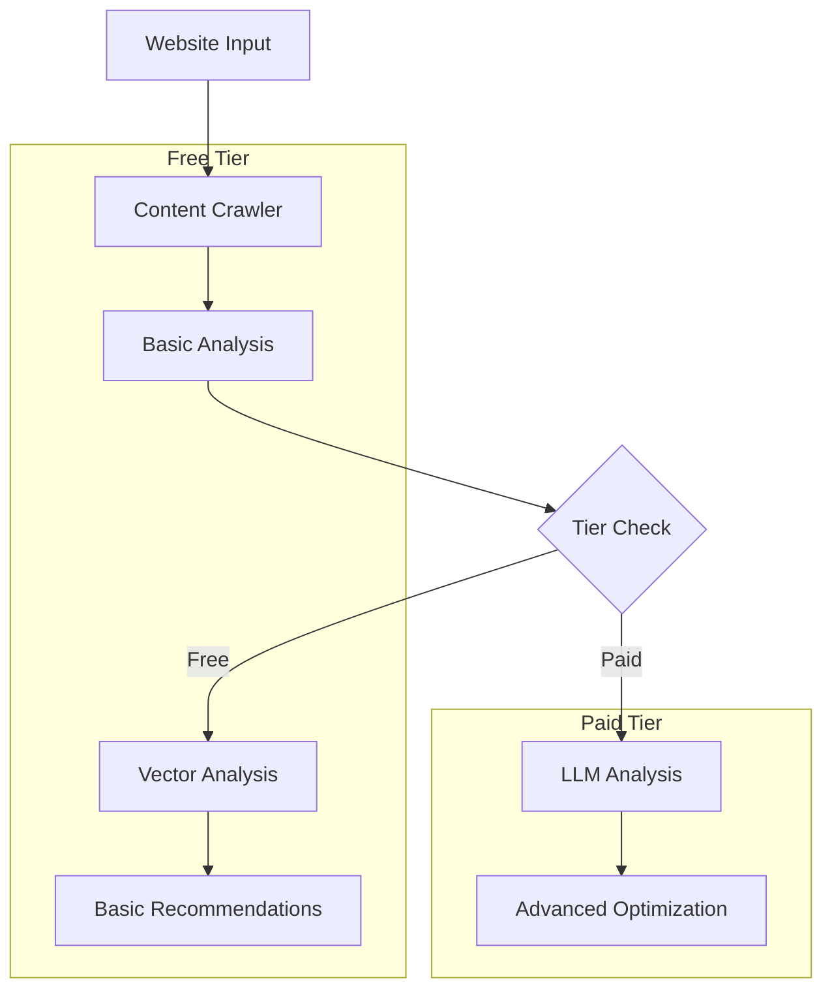

# Cost-Optimized AI Agent Optimization Architecture

## 1. Free Tier Architecture

### Non-LLM Components (Free Tier)
```typescript
class FreeTierAnalyzer {
  async analyze(website: string): Promise<BasicAnalysis> {
    const results = await Promise.all([
      this.basicCrawler.crawl(website),       // No LLM cost
      this.structureAnalyzer.analyze(),       // No LLM cost
      this.metadataExtractor.extract(),       // No LLM cost
      this.schemaValidator.validate(),        // No LLM cost
      this.vectorizer.generateEmbeddings()    // One-time cost, cached
    ]);
    
    return this.aggregateResults(results);
  }
}
```

Key Free Features:
1. Technical Analysis
- HTML structure validation
- Metadata completeness check
- Schema.org implementation check
- Basic accessibility analysis
- Load time analysis

2. Vector-Based Analysis
```typescript
class VectorAnalysis {
  // Use pre-computed embeddings
  private readonly standardEmbeddings = loadStandardEmbeddings();
  
  async analyzeContent(content: string): Promise<VectorScore> {
    // Generate embeddings using cached model
    const contentEmbedding = await this.vectorizer.embed(content);
    
    // Compare with pre-computed standards
    return this.compareEmbeddings(
      contentEmbedding,
      this.standardEmbeddings
    );
  }
}
```

3. Pattern Matching
```typescript
class PatternAnalyzer {
  async analyze(content: string): Promise<PatternResults> {
    return {
      structure: this.analyzeStructure(content),
      readability: this.calculateReadability(content),
      density: this.analyzeDensity(content),
      patterns: this.findCommonPatterns(content)
    };
  }
}
```

## 2. Paid Tier Architecture

### LLM Cost Breakdown

1. Knowledge Graph Construction
```typescript
interface LLMCosts {
  initialAnalysis: {
    cost: "~$0.06 per 1K tokens",
    usage: "One-time per page",
    optimization: "Cache results for 30 days"
  };
  
  relationshipExtraction: {
    cost: "~$0.03 per 1K tokens",
    usage: "Per content update",
    optimization: "Incremental updates only"
  };
  
  contextualAnalysis: {
    cost: "~$0.08 per 1K tokens",
    usage: "On-demand",
    optimization: "Batch processing"
  }
}
```

2. Content Optimization
```typescript
interface OptimizationCosts {
  contentRewriting: {
    cost: "~$0.10 per 1K tokens",
    usage: "Per optimization request",
    optimization: "Template-based where possible"
  };
  
  structuralAnalysis: {
    cost: "~$0.04 per 1K tokens",
    usage: "Per major update",
    optimization: "Cache common patterns"
  };
  
  recommendationGeneration: {
    cost: "~$0.06 per 1K tokens",
    usage: "Daily updates",
    optimization: "Rule-based fallbacks"
  }
}
```

## 3. Cost Optimization Strategies

### 1. Caching System
```typescript
class CachingSystem {
  private cache: Cache;
  private vectorDB: VectorDatabase;
  
  async getCachedAnalysis(content: string): Promise<Analysis | null> {
    // Check exact match cache
    const cached = await this.cache.get(this.hash(content));
    if (cached) return cached;
    
    // Check similar content cache
    const similar = await this.vectorDB.findSimilar(
      await this.vectorize(content),
      0.95 // 95% similarity threshold
    );
    
    return similar ? this.adaptCachedAnalysis(similar, content) : null;
  }
}
```

### 2. Hybrid Analysis System
```typescript
class HybridAnalyzer {
  async analyze(content: string): Promise<Analysis> {
    // Start with rule-based analysis (free)
    const basicAnalysis = await this.ruleBasedAnalyzer.analyze(content);
    
    // Use vector similarity for initial enhancement (cheap)
    const vectorAnalysis = await this.vectorAnalyzer.analyze(content);
    
    // Only use LLM if necessary (expensive)
    if (this.requiresLLM(basicAnalysis, vectorAnalysis)) {
      return this.llmAnalyzer.enhance(basicAnalysis, vectorAnalysis);
    }
    
    return this.combineAnalyses(basicAnalysis, vectorAnalysis);
  }
}
```

### 3. Progressive Enhancement
```typescript
class ProgressiveOptimizer {
  async optimize(content: string, tier: 'free' | 'basic' | 'premium'): Promise<Optimization> {
    // Start with free optimizations
    let optimization = await this.basicOptimizer.optimize(content);
    
    if (tier === 'free') return optimization;
    
    // Add vector-based enhancements for basic tier
    if (tier === 'basic') {
      optimization = await this.vectorOptimizer.enhance(optimization);
      return optimization;
    }
    
    // Add LLM-based optimizations for premium tier
    return await this.llmOptimizer.enhance(optimization);
  }
}
```

## 4. Technical Architecture



## 5. Cost Reduction Techniques

1. Embedding Caching
```typescript
class EmbeddingCache {
  private static readonly CACHE_DURATION = 30 * 24 * 60 * 60; // 30 days
  
  async getEmbedding(content: string): Promise<Vector> {
    const cached = await this.cache.get(this.hash(content));
    if (cached) return cached;
    
    const embedding = await this.generateEmbedding(content);
    await this.cache.set(this.hash(content), embedding, this.CACHE_DURATION);
    
    return embedding;
  }
}
```

2. Pattern Recognition
```typescript
class PatternOptimizer {
  private patterns: Map<string, Optimization>;
  
  async optimize(content: string): Promise<Optimization> {
    // Check for known patterns first
    const matchedPattern = this.findMatchingPattern(content);
    if (matchedPattern) {
      return this.applyPattern(matchedPattern, content);
    }
    
    // Fall back to LLM only if necessary
    return this.llmOptimize(content);
  }
}
```

3. Batch Processing
```typescript
class BatchProcessor {
  private queue: Queue<ContentItem>;
  
  async processBatch(): Promise<void> {
    const batch = await this.queue.getBatch(50);
    
    // Process similar content together
    const groupedContent = this.groupSimilarContent(batch);
    
    for (const group of groupedContent) {
      // Use single LLM call for similar content
      const groupAnalysis = await this.analyzeGroup(group);
      await this.applyGroupAnalysis(group, groupAnalysis);
    }
  }
}
```
