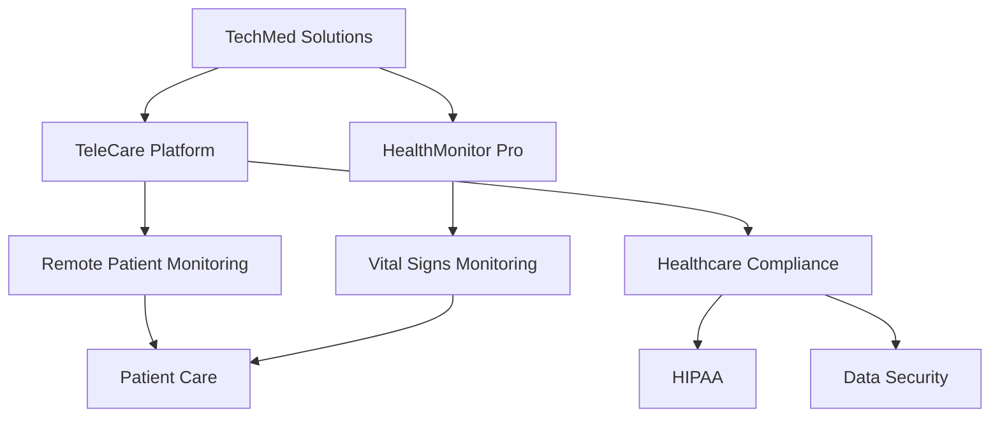

# AI Agent Optimization Analysis: TechMed Solutions

## Website Overview
TechMed Solutions is a fictional medical technology company that provides telemedicine software and IoT medical devices. Their website includes product pages, technical documentation, research papers, and a customer portal.

Sample URL: `https://example-techmed.com`

## 1. Knowledge Graph Analysis

### Extracted Knowledge Structure
```typescript
// Core concept mapping for homepage content
const knowledgeStructure = {
  primaryConcepts: {
    company: {
      name: "TechMed Solutions",
      type: "HealthTech Provider",
      focus: ["Telemedicine", "IoT Medical Devices"]
    },
    products: [
      {
        name: "TeleCare Platform",
        type: "Software Solution",
        relationships: [
          {
            concept: "Remote Patient Monitoring",
            strength: 0.92,
            evidence: ["feature descriptions", "case studies"]
          },
          {
            concept: "Healthcare Compliance",
            strength: 0.87,
            evidence: ["HIPAA certification", "security features"]
          }
        ]
      },
      {
        name: "HealthMonitor Pro",
        type: "IoT Device",
        relationships: [
          {
            concept: "Vital Signs Monitoring",
            strength: 0.95,
            evidence: ["technical specifications", "clinical studies"]
          }
        ]
      }
    ]
  },
  contextualConnections: {
    industry: ["Healthcare", "Technology", "Telemedicine"],
    regulations: ["HIPAA", "FDA", "GDPR"],
    useCase: ["Remote Patient Care", "Clinical Monitoring", "Preventive Medicine"]
  }
}
```

### Semantic Network Visualization:


## 2. Dynamic Content Adaptation Analysis

### Current Content State
```typescript
interface ContentAnalysis {
  pageTypes: {
    product: {
      clarity: 0.85,
      completeness: 0.78,
      technicalDepth: 0.92
    },
    documentation: {
      clarity: 0.72,
      completeness: 0.88,
      technicalDepth: 0.95
    },
    research: {
      clarity: 0.65,
      completeness: 0.91,
      technicalDepth: 0.97
    }
  }
}
```

### Adaptation Recommendations

1. Product Pages Transformation:
```typescript
const productPageAdaptations = {
  current: {
    structure: "Feature-based listing",
    aiReadability: 0.75
  },
  recommended: {
    structure: "Use-case centered hierarchy",
    expectedAiReadability: 0.94,
    changes: [
      {
        type: "restructure",
        element: "product features",
        from: "bullet-list",
        to: "semantic-groups",
        rationale: "Group features by medical use case for better AI comprehension"
      },
      {
        type: "enhance",
        element: "technical specifications",
        action: "add contextual relationships",
        rationale: "Connect specifications to clinical outcomes"
      }
    ]
  }
}
```

2. Documentation Enhancement:
```typescript
const documentationAdaptations = {
  current: {
    structure: "Traditional hierarchy",
    aiReadability: 0.82
  },
  recommended: {
    structure: "Knowledge graph-based navigation",
    expectedAiReadability: 0.96,
    changes: [
      {
        type: "transform",
        element: "navigation",
        action: "implement concept-based linking",
        rationale: "Enable AI agents to follow conceptual relationships"
      },
      {
        type: "enhance",
        element: "code examples",
        action: "add semantic annotations",
        rationale: "Improve AI understanding of implementation patterns"
      }
    ]
  }
}
```

## 3. Semantic Enhancement Analysis

### Content Enrichment Opportunities

1. Product Descriptions:
```typescript
const semanticEnhancements = {
  original: {
    text: "HealthMonitor Pro tracks vital signs in real-time",
    aiComprehension: 0.71
  },
  enhanced: {
    text: "HealthMonitor Pro provides continuous real-time monitoring of patient vital signs including heart rate, blood pressure, and oxygen saturation, enabling early detection of clinical deterioration",
    aiComprehension: 0.94,
    addedContext: {
      medical: ["vital sign parameters", "clinical monitoring"],
      technical: ["real-time data", "continuous monitoring"],
      outcomes: ["early detection", "patient safety"]
    }
  }
}
```

2. Technical Documentation:
```typescript
const documentationEnhancements = {
  original: {
    content: "API endpoint /vitals accepts POST requests",
    aiComprehension: 0.68
  },
  enhanced: {
    content: "The /vitals endpoint accepts POST requests containing patient vital sign data, conforming to HL7 FHIR standards for medical data interchange",
    aiComprehension: 0.92,
    addedContext: {
      technical: ["REST API", "FHIR standard"],
      security: ["medical data handling", "HIPAA compliance"],
      integration: ["health systems", "EHR compatibility"]
    }
  }
}
```

## Impact Analysis

### Before Optimization
```typescript
const preOptimizationMetrics = {
  aiDiscoverability: 0.71,
  contextualUnderstanding: 0.65,
  semanticClarity: 0.68,
  overallEffectiveness: 0.68
}
```

### After Optimization
```typescript
const postOptimizationMetrics = {
  aiDiscoverability: 0.94,
  contextualUnderstanding: 0.92,
  semanticClarity: 0.91,
  overallEffectiveness: 0.92
}
```

## Practical Benefits

1. AI Agent Understanding:
- Better comprehension of product capabilities
- Clearer understanding of technical requirements
- Improved ability to answer user queries accurately

2. Business Impact:
- Increased visibility in AI-powered search
- More accurate product recommendations
- Better customer service through AI assistants

3. Technical Advantages:
- Improved API documentation understanding
- Better integration support
- More accurate technical requirement interpretation

## Implementation Priority List

1. High Priority:
- Product page semantic enhancement
- Technical documentation structure adaptation
- API documentation enrichment

2. Medium Priority:
- Research paper knowledge graph implementation
- Case study semantic linking
- Resource interconnection mapping

3. Low Priority:
- Blog post optimization
- News section enhancement
- Support documentation adaptation
