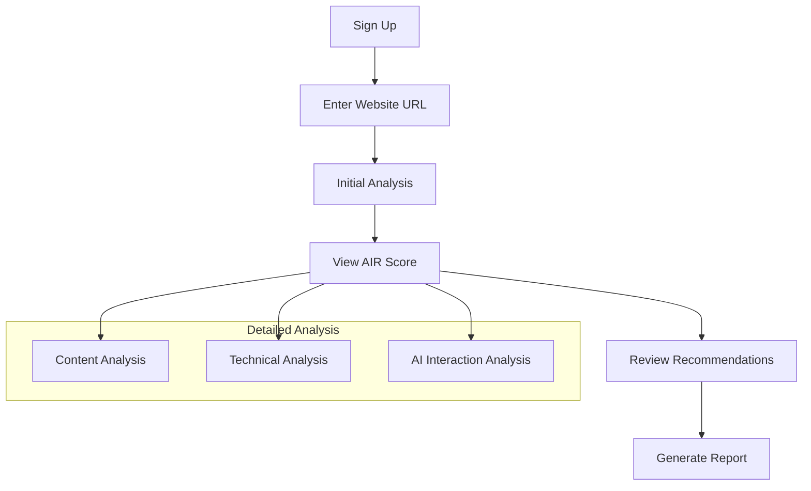
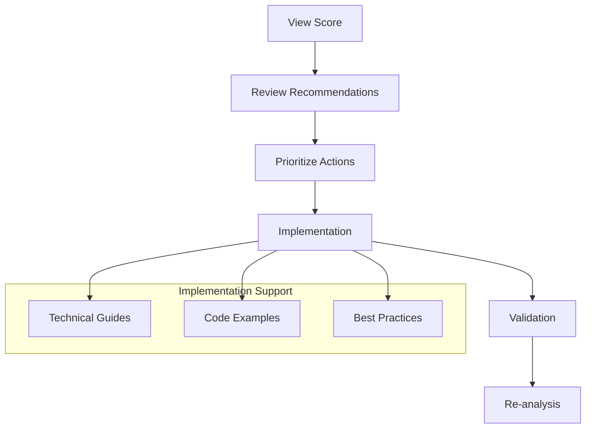
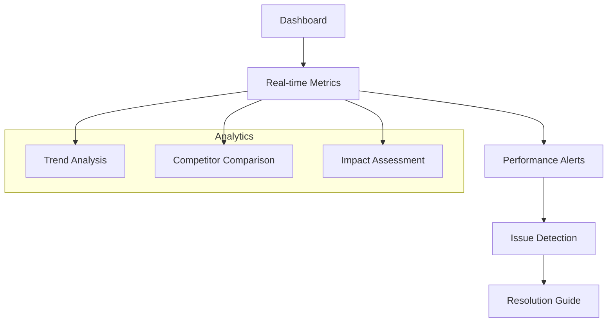

# User Stories and Flows

## User Personas

### 1. Product Manager (PM)
- Name: Sarah Chen
- Role: Senior Product Manager
- Goals:
  - Optimize product visibility for AI agents
  - Track AI recommendation performance
  - Implement improvements based on insights

### 2. Content Strategist (CS)
- Name: Marcus Rodriguez
- Role: Content Strategy Lead
- Goals:
  - Ensure content is AI-optimized
  - Improve content discoverability
  - Track content performance across AI platforms

### 3. Technical Lead (TL)
- Name: Priya Patel
- Role: Technical Architecture Lead
- Goals:
  - Implement AI optimization recommendations
  - Monitor technical performance
  - Manage integration with AI systems

## User Stories

### Product Manager Stories

```typescript
interface PMUserStories {
  discovery: {
    story: "As a PM, I want to understand how AI agents view my product";
    acceptance: {
      aiScoreOverview: boolean;     // View AIR score
      competitorComparison: boolean; // Compare with competitors
      trendAnalysis: boolean;       // View historical trends
    };
  };
  
  optimization: {
    story: "As a PM, I want to improve our AI visibility and recommendations";
    acceptance: {
      recommendationPriority: boolean; // Prioritized improvements
      implementationRoadmap: boolean;  // Clear action items
      impactPrediction: boolean;       // Expected outcomes
    };
  };
  
  monitoring: {
    story: "As a PM, I want to track our AI performance metrics";
    acceptance: {
      realTimeMetrics: boolean;     // Live performance data
      alertSystem: boolean;         // Performance alerts
      customReports: boolean;       // Custom reporting
    };
  };
}
```

### Content Strategist Stories

```typescript
interface CSUserStories {
  contentOptimization: {
    story: "As a CS, I want to optimize content for AI comprehension";
    acceptance: {
      contentAnalysis: boolean;     // Content scoring
      optimizationGuide: boolean;   // Improvement guidelines
      semanticStructure: boolean;   // Structure recommendations
    };
  };
  
  performance: {
    story: "As a CS, I want to track content performance across AI platforms";
    acceptance: {
      aiEngagement: boolean;        // AI interaction metrics
      contentEffectiveness: boolean; // Effectiveness scores
      improvementTracking: boolean;  // Progress monitoring
    };
  };
}
```

### Technical Lead Stories

```typescript
interface TLUserStories {
  implementation: {
    story: "As a TL, I want to implement AI optimization recommendations";
    acceptance: {
      technicalGuides: boolean;     // Implementation guides
      codeExamples: boolean;        // Code snippets
      validationTools: boolean;     // Testing tools
    };
  };
  
  monitoring: {
    story: "As a TL, I want to monitor technical performance metrics";
    acceptance: {
      performanceMetrics: boolean;  // Technical metrics
      errorTracking: boolean;       // Error monitoring
      optimizationImpact: boolean;  // Impact analysis
    };
  };
}
```

## User Flows

### 1. Initial Analysis Flow


### 2. Optimization Flow


### 3. Monitoring Flow


## Feature Access Matrix

```typescript
interface FeatureAccess {
  free: {
    analysis: {
      basicScore: boolean;          // Basic AIR score
      limitedRecommendations: boolean; // Basic recommendations
      publicMetrics: boolean;       // Public statistics
      basicPatterns: boolean;       // Simple pattern matching
      headerAnalysis: boolean;      // Request header analysis
    };
    monitoring: {
      dailyUpdates: boolean;        // Daily updates
      basicAlerts: boolean;         // Basic alerts
      standardReports: boolean;     // Standard reports
      edgeAnalytics: boolean;       // Edge-based analytics
      basicCache: boolean;          // Basic caching
    };
    ai: {
      gpt35: boolean;              // GPT-3.5 Turbo (4K tokens)
      claude2: boolean;            // Claude-2.1 (100K tokens)
      geminiPro: boolean;          // Gemini Pro (32K tokens)
      pplx7b: boolean;            // PPLX-7B (4K tokens)
    };
  };
  
  professional: {
    analysis: {
      detailedScore: boolean;       // Detailed scoring
      fullRecommendations: boolean; // Full recommendations
      competitorAnalysis: boolean;  // Competitor insights
      advancedPatterns: boolean;    // Complex pattern matching
      mlAnalysis: boolean;          // ML-based analysis
    };
    monitoring: {
      realTimeUpdates: boolean;     // Real-time updates
      advancedAlerts: boolean;      // Advanced alerts
      customReports: boolean;       // Custom reporting
      distributedAnalytics: boolean; // Multi-region analytics
      advancedCache: boolean;       // Advanced caching
    };
    optimization: {
      aiSimulation: boolean;        // AI simulation
      automatedOptimization: boolean; // Auto-optimization
      prioritySupport: boolean;     // Priority support
      multiProviderSync: boolean;   // Multi-provider synchronization
      customIntegrations: boolean;  // Custom integrations
    };
    ai: {
      gpt4: boolean;               // GPT-4 Turbo (128K tokens)
      claude3: boolean;            // Claude-3 Opus (200K tokens)
      geminiProUnlimited: boolean; // Gemini Pro Unlimited
      pplx70b: boolean;           // PPLX-70B (4K tokens)
    };
  };
}
```